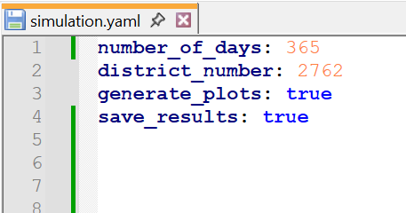
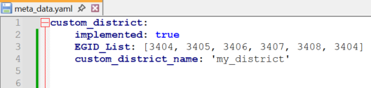
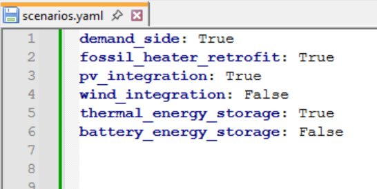
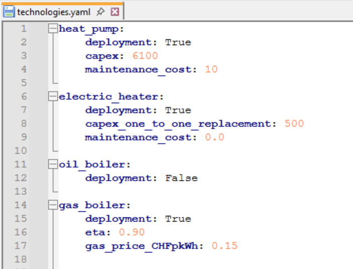

Model Input - Configuration Files
=================================

Configuration files specify the simulation settings (e.g., included buildings, temporal scope, output variables) and define the energy system configuration (e.g., scenarios, technologies, selected year). They are provided to the model in YAML format and must be located in the ``config/input_files`` directory. The only file required is ``simluation.yaml``. For the other files, only parameters that deviate from the default values need to be specified. If no configuration files are provided other than ``simluation.yaml``, the model will run entirely using its built-in standard values (see tables below).

Required configuration file:

- ``simulation.yaml``

Optional configuration files:

- ``meta_data.yaml``

- ``scenarios.yaml``

- ``optimisation.yaml``

- ``demand_side.yaml``

- ``supply.yaml``

- ``technologies.yaml``

By default, all scenarios and optimisation are deactivated. The following technologies are activated, reflecting technologies currently deployed in Switzerland:

- Heat Pump

- Electric Heater

- Oil Boiler

- Gas Boiler

- Wood Boiler

- Disctrict Heating

- Solar Thermal

- Solar PV

- Wind Power

- Hydro Power

- Grid Supply

All files define parameter names as top-level keys. The exception is technologies.yaml, where technologies appear as the top-level keys and their respective parameters are listed as sub-keys.

Below are example excerpts from some configuration files:

----

   
----

----

.. image:: images/optimisation_yaml.png
   :width: 25%

----

Simulation
---------
Configuration file: ``simulation.yaml``

.. include:: ../how_to_use_the_model/input_csv_as_rst/simulation.rst

Meta Data
---------
Configuration file: ``meta_data.yaml``

.. include:: ../how_to_use_the_model/input_csv_as_rst/meta_data.rst

Scenarios
---------
Configuration file: ``scenarios.yaml``

.. include:: ../how_to_use_the_model/input_csv_as_rst/scenarios.rst

Optimisation
---------
Configuration file: ``optimisation.yaml``

.. include:: ../how_to_use_the_model/input_csv_as_rst/optimisation.rst

Demand Side
---------
Configuration file: ``demand_side.yaml``

.. include:: ../how_to_use_the_model/input_csv_as_rst/demand_side.rst

Supply
---------
Configuration file: ``supply.yaml``

.. include:: ../how_to_use_the_model/input_csv_as_rst/supply.rst
		  

Technologies
---------

Configuration file: ``technologies.yaml``

Heat Pump
^^^^^^^^^^
Top key: ``heat_pump``
			
.. include:: ../how_to_use_the_model/input_csv_as_rst/heat_pump.rst

Electric Heater
^^^^^^^^^^
Top key: ``electric_heater``
			
.. include:: ../how_to_use_the_model/input_csv_as_rst/electric_heater.rst

			
Oil Boiler
^^^^^^^^^^
Top key: ``oil_boiler``

.. include:: ../how_to_use_the_model/input_csv_as_rst/oil_boiler.rst
			

Gas Boiler
^^^^^^^^^^
Top key: ``gas_boiler``

.. include:: ../how_to_use_the_model/input_csv_as_rst/gas_boiler.rst

Wood Boiler
^^^^^^^^^^
Top key: ``wood_boiler``

.. include:: ../how_to_use_the_model/input_csv_as_rst/wood_boiler.rst

District Heating
^^^^^^^^^^
Top key: ``district_heating``

.. include:: ../how_to_use_the_model/input_csv_as_rst/district_heating.rst

Solar Thermal
^^^^^^^^^^
Top key: ``solar_thermal``

.. include:: ../how_to_use_the_model/input_csv_as_rst/solar_thermal.rst

Solar Photovoltaic (PV)
^^^^^^^^^^
Top key: ``solar_pv``

.. include:: ../how_to_use_the_model/input_csv_as_rst/solar_pv.rst

Wind Power
^^^^^^^^^^
Top key: ``wind_power``

.. include:: ../how_to_use_the_model/input_csv_as_rst/wind_power.rst

Hydro Power
^^^^^^^^^^
Top key: ``hydro_power``

.. include:: ../how_to_use_the_model/input_csv_as_rst/hydro_power.rst

Grid Supply
^^^^^^^^^^
Top key: ``grid_supply``

.. include:: ../how_to_use_the_model/input_csv_as_rst/grid_supply.rst

Thermal Energy Storage (TES) - centralised
^^^^^^^^^^
Top key: ``tes``

.. include:: ../how_to_use_the_model/input_csv_as_rst/tes.rst

Thermal Energy Storage (TES) - decentralised
^^^^^^^^^^
Top key: ``tes_decentralised``

.. include:: ../how_to_use_the_model/input_csv_as_rst/tes_decentralised.rst

Battery Energy Storage (BES)
^^^^^^^^^^
Top key: ``bes``

.. include:: ../how_to_use_the_model/input_csv_as_rst/bes.rst

Biomass
^^^^^^^^^^
Top key: ``biomass``

.. include:: ../how_to_use_the_model/input_csv_as_rst/biomass.rst

Hydrothermal Gasification
^^^^^^^^^^
Top key: ``hydrothermal_gasification``

.. include:: ../how_to_use_the_model/input_csv_as_rst/hydrothermal_gasification.rst

Anaerobic Digestion Upgrade
^^^^^^^^^^
Top key: ``anaerobic_digestion_upgrade``

.. include:: ../how_to_use_the_model/input_csv_as_rst/anaerobic_digestion_upgrade.rst

Anaerobic Digestion Upgrade Hydrogen
^^^^^^^^^^
Top key: ``anaerobic_digestion_upgrade_hydrogen``

.. include:: ../how_to_use_the_model/input_csv_as_rst/anaerobic_digestion_upgrade_hydrogen.rst

Anaerobic Digestion Combined Heat and Power (CHP)
^^^^^^^^^^
Top key: ``anaerobic_digestion_chp``

.. include:: ../how_to_use_the_model/input_csv_as_rst/anaerobic_digestion_chp.rst

Wood Gasification Upgrade
^^^^^^^^^^
Top key: ``wood_gasification_upgrade``

.. include:: ../how_to_use_the_model/input_csv_as_rst/wood_gasification_upgrade.rst

Wood Gasification Upgrade Hydrogen
^^^^^^^^^^
Top key: ``wood_gasification_upgrade_hydrogen``

.. include:: ../how_to_use_the_model/input_csv_as_rst/wood_gasification_upgrade_hydrogen.rst

Wood Digestion Combined Heat and Power (CHP)
^^^^^^^^^^
Top key: ``wood_digestion_chp``

.. include:: ../how_to_use_the_model/input_csv_as_rst/wood_digestion_chp.rst

Hydrogen Production
^^^^^^^^^^
Top key: ``hydrogen_production``

.. include:: ../how_to_use_the_model/input_csv_as_rst/hydrogen_production.rst

Gas Turbine Combined Heat and Power (CHP) - small scale
^^^^^^^^^^
Top key: ``chp_gt``

.. include:: ../how_to_use_the_model/input_csv_as_rst/chp_gt.rst

Gas Turbine - centralised plant (cp)
^^^^^^^^^^
Top key: ``gas_turbine_cp``

.. include:: ../how_to_use_the_model/input_csv_as_rst/gas_turbine_cp.rst

Steam Turbine
^^^^^^^^^^
Top key: ``steam_turbine``

.. include:: ../how_to_use_the_model/input_csv_as_rst/steam_turbine.rst

Wood Boiler - steam generator (cp)
^^^^^^^^^^
Top key: ``wood_boiler_sg``

.. include:: ../how_to_use_the_model/input_csv_as_rst/wood_boiler_sg.rst

Wood Boiler - centralised plant (cp)
^^^^^^^^^^
Top key: ``wood_boiler_cp``

.. include:: ../how_to_use_the_model/input_csv_as_rst/wood_boiler_cp.rst

Gas Boiler - centralised plant (cp)
^^^^^^^^^^
Top key: ``gas_boiler_cp``

.. include:: ../how_to_use_the_model/input_csv_as_rst/gas_boiler_cp.rst

Oil Boiler - centralised plant (cp)
^^^^^^^^^^
Top key: ``oil_boiler_cp``

.. include:: ../how_to_use_the_model/input_csv_as_rst/oil_boiler_cp.rst

Electric heater - centralised plant (cp)
^^^^^^^^^^
Top key: ``electric_heater_cp``

.. include:: ../how_to_use_the_model/input_csv_as_rst/electric_heater_cp.rst

Waste Heat
^^^^^^^^^^
Top key: ``waste_heat``

.. include:: ../how_to_use_the_model/input_csv_as_rst/waste_heat.rst

Waste Heat (Low Temperature)
^^^^^^^^^^
Top key: ``waste_heat_low_temperature``

.. include:: ../how_to_use_the_model/input_csv_as_rst/waste_heat_low_temperature.rst

Waste-to-Energy Combined Heat and Power
^^^^^^^^^^
Top key: ``waste_to_energy``

.. include:: ../how_to_use_the_model/input_csv_as_rst/waste_to_energy.rst

Heat Pump - centralised plant (cp)
^^^^^^^^^^
Top key: ``heat_pump_cp``

.. include:: ../how_to_use_the_model/input_csv_as_rst/heat_pump_cp.rst

Heat Pump - centralised plant (cp) (from low temperature waste heat)
^^^^^^^^^^
Top key: ``heat_pump_cp_lt``

.. include:: ../how_to_use_the_model/input_csv_as_rst/heat_pump_cp_lt.rst

Other
^^^^^^^^^^
Top key: ``other``

.. csv-table::
			:file: input_csv/other.csv
			:widths: auto
			:header-rows: 1

References
-----------

Ben-Kiki, Oren, Clark, Clark Evans, and Ingy döt Net. *YAML Ain’t Markup Language (YAML™) Version 1.2 (3rd Edition)*. 2009.
