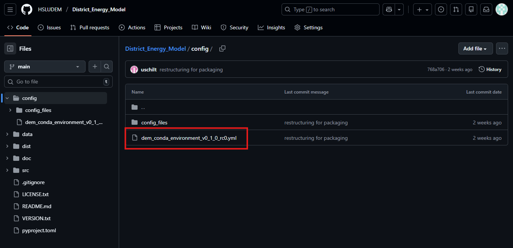
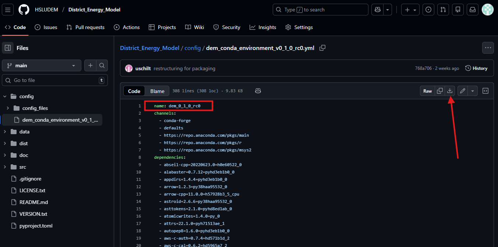

Installation
====================

**Requirements**

It is recommended to install DEM in a dedicated ``Conda`` environment to ensure that all dependencies are available in compatible versions (see the steps below).

To run optimisation studies, a solver must be installed before installing DEM. If only simulations are required, no solver installation is necessary. Optimisation in DEM is implemented using the |Calliope_link| framework, and any solver listed on the |Calliope_documentation_link| can be used.

.. note::
  DEM has been tested on Windows with |Calliope_version_link| in combination with the |Gurobi_link| solver.

**Step 1: Create the Conda Environment**

If not already done, download and install |Conda_link| on your operating system. DEM is tested with the ``Conda`` environment provided in a file on GitHub. Locate the file named ``dem_conda_environment_vX_Y_Z.yml`` (or similar) in the |GitHub_config_link|. Click on the file (see screenshot 1) and download it (see arrow on screenshot 2). Make sure to use the correct version (e.g. ``dem_conda_environment_v0_1_0.yml`` for version ``0.1.0``). In the file you can also see the name of the environment that will be created (see red rectangle in screenshot 2).

*Screenshot 1:*

  
*Screenshot 2:*

Open the terminal window and navigate to the directory where the .yml file is located. Create a new Conda environment from this file:

.. code-block:: shell

    conda env create -f dem_conda_environment_vX_Y_Z.yml
    conda activate dem_X_Y_Z

Refer to the |Conda_doc_link| for instructions. If you are unfamiliar with Conda, consult the |Conda_userguide_link|.

**Step 2: Install the District Energy Model**

After activating the environment, install DEM with ``pip``:

.. code-block:: shell

    pip install district_energy_model

Now you can run the model (see :doc:`run_model`).

.. Links:

.. |Calliope_link| raw:: html

   <a href="https://calliope.readthedocs.io/en/stable/index.html" target="_blank">Calliope</a>

.. |Calliope_documentation_link| raw:: html

   <a href="https://calliope.readthedocs.io/en/stable/user/installation.html" target="_blank">Calliope documentation page</a>

.. |Calliope_version_link| raw:: html

   <a href="https://calliope.readthedocs.io/en/v0.6.8/index.html" target="_blank">Calliope v0.6.8</a>

.. |Gurobi_link| raw:: html

   <a href="https://www.gurobi.com/" target="_blank">Gurobi</a>

.. |Conda_link| raw:: html

   <a href="https://www.anaconda.com/docs/getting-started/miniconda/main" target="_blank">Conda</a>

.. |GitHub_link| raw:: html

   <a href="https://github.com/HSLUDEM/District_Energy_Model" target="_blank">GitHub</a>

.. |GitHub_config_link| raw:: html

   <a href="https://github.com/HSLUDEM/District_Energy_Model/tree/main/config" target="_blank">config directory</a>

.. |Conda_doc_link| raw:: html

   <a href="https://docs.conda.io/projects/conda/en/latest/user-guide/tasks/manage-environments.html#creating-an-environment-from-an-environment-yml-file" target="_blank">Conda documentation</a>

.. |Conda_userguide_link| raw:: html

   <a href="https://docs.conda.io/projects/conda/en/latest/user-guide/index.html" target="_blank">user guide</a>

