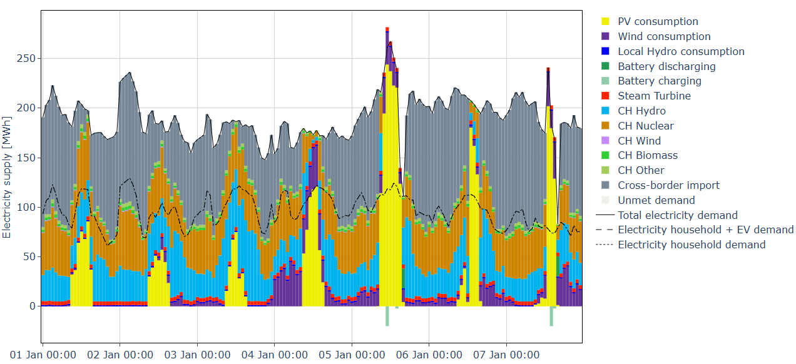

District Energy Model
=========================================================

District Energy Model (DEM) is a Python-based multi-energy system model for simulating energy demand, generation, storage, and optimisation at the district and municipal scale.
The model is developed at |CCTES_link| in the framework of the |EDGE_link| project.

DEM can be used for any region, but is tailored to the Swiss context. It allows energy simulations and optimisation studies to be conducted for any Swiss municipality or district without local data collection and with minimal configuration effort.

.. meta::
   :google-site-verification: uPS4GuakMcpNFosZdasaheIiHnIU3YC0kMz8BSsLjJQ

.. note::

   This documentation is newly launched and remains under active development. Some sections are still incomplete. If you cannot find the information you are looking for, please refer to the :doc:`publications` page or reach out via the :doc:`contact` page.

..
   .. image:: images/geo_plot_renewable_s0.svg

Check out the :doc:`introduction` section for further information. To get started with DEM, it is recommended to consult the :ref:`how_to_use_the_model` section and work through the :ref:`Tutorials <tutorials>`.

The District Energy Model has been applied and mentioned in various publications (see :doc:`publications`).

The source code is published on |GitHub_link| and can be used under the |License_link|.

A public platform for municipal energy planning in Switzerland based on the DEM has also been developed and can be accessed here:

|Recommender_Tool_link|

Documentation
-----------------

.. toctree::
   :maxdepth: 3

   introduction
   
   how_to_use_the_model/index
   
   tutorials/index
   
   modelling_method/index
   
   publications
   
   contact

.. Links:

.. |CCTES_link| raw:: html

   <a href="https://www.hslu.ch/cctes" target="_blank">HSLU CC TES</a>

.. |EDGE_link| raw:: html

   <a href="https://www.sweet-edge.ch/en" target="_blank">SWEET EDGE</a>

.. |GitHub_link| raw:: html

   <a href="https://github.com/HSLUDEM/District_Energy_Model" target="_blank">GitHub</a>

.. |License_link| raw:: html

   <a href="https://github.com/HSLUDEM/District_Energy_Model?tab=Apache-2.0-1-ov-file" target="_blank">Apache-2.0 license</a>

.. |Recommender_Tool_link| raw:: html

   <a href="https://prototype.recommendertool.ch/" target="_blank">RECOMMENDER TOOL</a>

