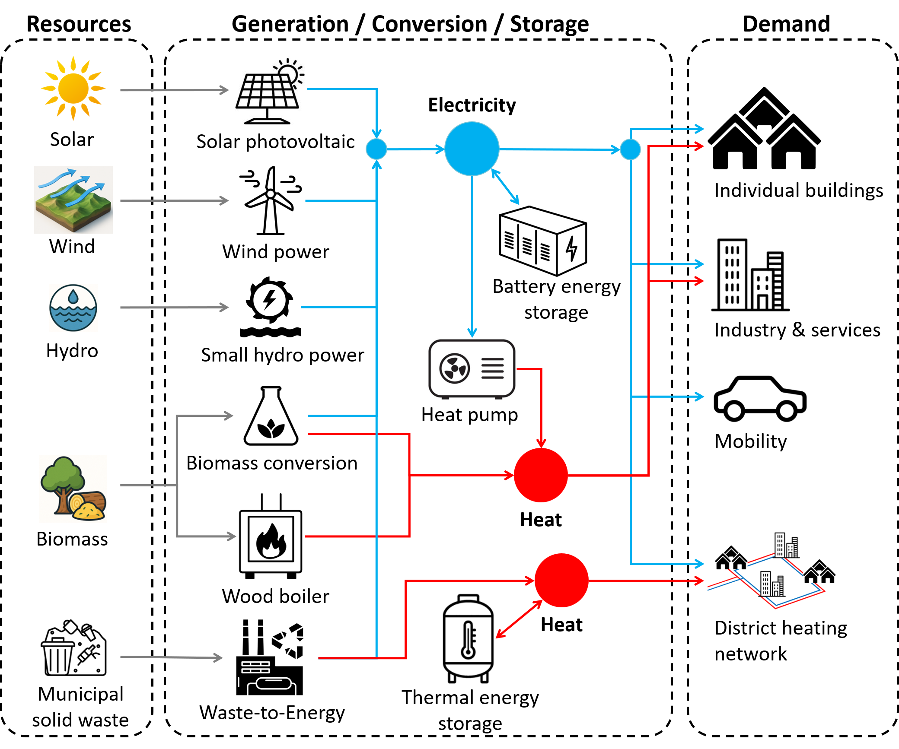

# Summary

The transition from centralised to decentralised energy systems for achieving net-zero emission targets requires the evaluation of potential future scenarios on various spatial scales [ref]. For this purpose, computational energy system models are deployed. The *District Energy Model (DEM)* is a Python-based multi-energy system model designed to simulate scenarios from neighbourhood to regional scale with a focus on the integration of decentralized renewable energy technologies (e.g., solar, wind, biomass). DEM runs simulation and optimisation studies in hourly resolution using a "snapshot-year" approach [ref Marechal]. DEM is deployed as an open-source Python library, available as a PyPi package. Once installed, it can be launched with a command-line interface, not requiring any Python programming knowledge. Alternatively, a Python API is also provided so that it can be run programmatically. Two types of input files are required for the DEM to run: *configuration files* and *data files*. *Configuration files* specify the simulation metrics (e.g., buildings to consider, simulation timeframe, output to generate) and define the energy system configuration (e.g., scenarios, technologies, selected year). These are provided in YAML format [ref]. In Python, configuration input can also be passed directly to DEM without the need of configuration files. *Data files* contain information about energy demand, generation potential, and ambient conditions. These are provided to DEM in FEATHER format [ref]. For selected regions, data files have been compiled from public data sources and made available on a public repository to be used with DEM. This provides modellers with a fully parametrised model, eliminating the need of collecting and compiling such data. For example, data for a full parametrisation of DEM is available for every municipality in Switzerland.

The DEM comes with a detailed [documentation](https://dem-documentation.readthedocs.io/en/latest/) providing step-by-step instructions, explaining the modelling approaches and methods, and listing information about publications and research related to DEM.

# Statement of need

Many open-source energy system modelling frameworks exist, such as e.g., SESMG [ref], EHTOS.FINE [ref], REHO [ref], CESAR-P [ref], EnergyPlus [ref], EnergyScope [ref] (..find more). Each model has strengths and weaknesses and specific scopes of application. While these models provide valuable frameworks for evaluating multi-energy systems on various spatial and temporal scales, they require the modeller to provide input data such as demand profiles, cost information, or technology specifications. A large portion of the work when creating simulation studies using a modelling framework goes into the collection and generation of such data. DEM eliminates the need for this work as it already provides this type of data for selected regions and therefore greatly reduces the workload for the modeller. The provided data has been collected from various public sources and pre-processed for use in simulation studies. Therefore, simulation and optimisation studies can be carried out in DEM with minimal configuration requirements (e.g., which buildings to consider), while still maintaining maximum flexibility of substituting any of the pre-configured data with custom data and configurations if the need arises.
While an optimisation study is very useful to determine optimal technology design and operation, many energy provision scenarios can be simulated without applying optimisation. Therefore, DEM can also be run as a simulation without optimisation for various scenarios. This allows for short computation times and fast result generation.
The optimisation module in DEM is implemented using the Calliope framework [ref], which is based on the optimisation programming framework Pyomo [ref]. Optimisations in DEM can be carried out with most solvers compatible with Calliope.

-	What stands out from a research perspective? Flexibility considerations; local boundaries, while also considering national electricity provision (as an interface model between local, regional, and national energy planning)
-	Availability of open-source data: pulling it together in one model
-	Bottom-up demand consideration of individual buildings
-	Focus on integration of local, decentralized energy sources and technologies
-	Energy-planning on neighbourhood-scale
-	No extensive modelling required, yet flexible in scenario creation.
-	Pre-configured with standard values for the Swiss energy system
-	Automated parametrisation: Provided for Switzerland; Other countries to be added  can also be added by modellers, as the required data structure is provided
-	Selection of custom district
-	Optimisation optional

# Modelling approach

DEM simulates the energy flows in a district, combining bottom-up with top-down modelling. A district in this context can refer to anything from a small group of buildings to an entire municipality or city. Several characteristics are obtained for each individual building (e.g., building type, location, size, age, heat and electricity demand, heating system, solar energy resources), while other data is assessed on district-level (e.g., wind power resources, biomass resources, ambient conditions, mobility demand). The basis for any simulation are a set of resources (e.g., wind, solar, biomass, hydro), a set of technologies (generation, conversion, and storage), and a set of demand profiles for heat, electricity, and mobility. An exemplary energy system layout is shown in Fig. \autoref{fig:dem_layout}.
Any list of buildings can be passed to DEM for simulation of a district energy system.

-	Pyomo
-	Calliope

{ width=100% }

# Acknowledgements
The research published in this publication was carried out with the support of the Swiss Federal Office of Energy as part of the SWEET consortium EDGE. The authors bear sole responsibility for the conclusions and the results presented in this publication.

# References
-	Calliope
-	Pyomo
-	FEATHER
-	YAML